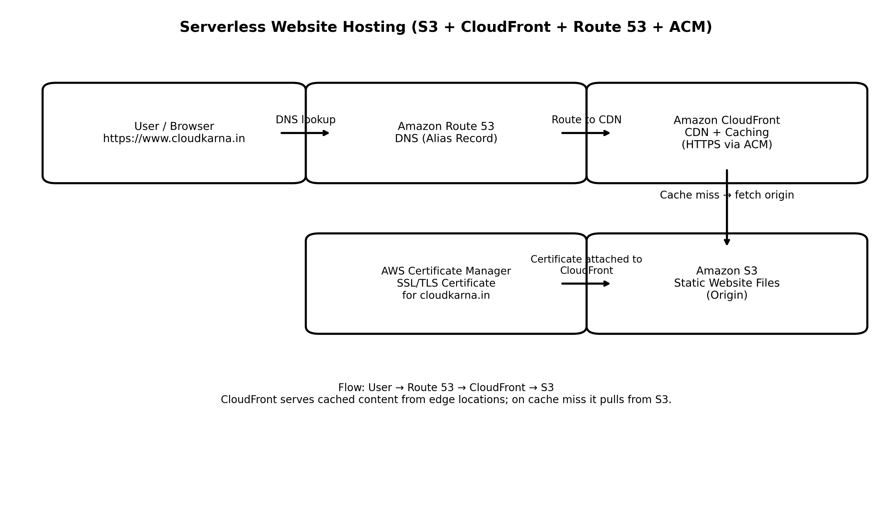

# 🌐 Cloudkarna – Serverless Portfolio Website (AWS)

🔗 Live Website: https://www.cloudkarna.in

This project is my personal portfolio website hosted using a **serverless AWS architecture**.
Instead of running a web server on EC2 (Nginx/Apache), I built a production-style setup using:

✅ Amazon S3 + CloudFront + Route 53 + ACM  
✅ No servers, no OS patching, no manual scaling

---

## 🧩 Architecture Diagram

---

## 🚀 What I Built (End-to-End)

### 🔹 Step 1: Static Website Hosting on Amazon S3
- Created an S3 bucket for hosting static files (HTML/CSS/JS)
- Uploaded website files and assets
- Configured the site entry point (index.html)

📌 Why S3?  
S3 is highly durable, scalable, and cost-effective for static web content.

---

### 🔹 Step 2: Secure the Bucket (Avoid Public Exposure)
- Blocked public access to the S3 bucket
- Allowed access only through CloudFront (recommended production approach)

📌 Why?  
Users should not access S3 directly. CloudFront becomes the only public entry point.

---

### 🔹 Step 3: Create CloudFront Distribution (CDN)
- Created a CloudFront distribution
- Set S3 as the origin
- Enabled caching and compression
- Configured Default Root Object: `index.html`

📌 Why CloudFront?  
CloudFront caches content at edge locations worldwide → faster load time and low latency.

---

### 🔹 Step 4: Enable HTTPS using AWS Certificate Manager (ACM)
- Requested SSL/TLS certificate in ACM
- Validated via DNS
- Attached the certificate to CloudFront

📌 Why HTTPS?  
Encrypts traffic, improves security, SEO, and gives the browser lock icon.

---

### 🔹 Step 5: Route 53 Domain Mapping
- Created Route 53 records
- Added Alias record:
  - `www.cloudkarna.in` → CloudFront distribution

📌 Why Alias record?  
AWS manages endpoint changes automatically and gives better reliability.

---

## 🔁 End-to-End Flow

User → Route 53 → CloudFront → S3

CloudFront serves cached content from the nearest edge location.
If content is not cached, CloudFront fetches it securely from S3.

---

## ✅ Final Outcome
✔ Fully serverless hosting (no EC2)  
✔ Global performance via CDN  
✔ HTTPS secure access  
✔ Low cost + high availability by default  
✔ Simple maintenance (upload files to S3, CloudFront handles delivery)

---

## 🧠 Key Learnings
- Static websites don’t need servers (EC2 is often overkill)
- CloudFront CDN improves performance globally
- Route 53 + ACM + CloudFront is a production-style serverless pattern

---

## 👤 Author
**Naga Ajay Ragyari**  
Cloud & DevOps Engineer

- GitHub: https://github.com/NagaAjay1812  
- LinkedIn: https://www.linkedin.com/in/naga-ajay-ragyari-55381b295/

